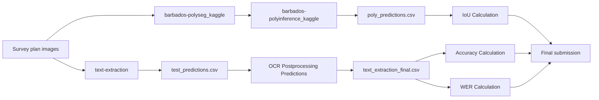

# Barbados Lands and Surveys Plot Automation Challenge

Solution for the [Barbados Lands and Surveys Plot Automation Challenge](https://zindi.africa/competitions/barbados-lands-and-surveys-plot-automation-challenge) on Zindi.

## Overview

In Barbados, survey plans are submitted to the Lands and Surveys Department in analog form. These documents are currently captured manually into the Survey Plan Register—a process that is slow, labor-intensive, and error-prone.

This challenge asks participants to build a solution that can:

1. **Detect and digitise land plot shapes** from scanned survey plans and convert them into standard digital formats (e.g. polygon geometry for shapefiles).
2. **Extract metadata** such as lot number, parcel area, and surveyor name using OCR or other machine learning techniques.

The extracted data should be ready for entry into a digital registry. This is a pilot challenge focused on one district in Barbados; winning models may be deployed nationally.

## Evaluation

The leaderboard score is a **weighted mean** of three metrics:

| Metric | Weight | Description |
|--------|--------|-------------|
| **IoU Polygon** | 0.5 | Overlap between predicted and reference plot polygons (0 = no overlap, 1 = perfect overlap) |
| **WER** | 0.2 | Word Error Rate on the `TargetSurvey` field |
| **MCA** | 0.3 | Multi-Column Accuracy across metadata fields |

### Metric details

- **WER** is computed from `TargetSurvey`, which concatenates **Land Surveyor**, **Surveyed For**, and **Address** (in that order), lowercased, with punctuation removed and whitespace normalised.
- **MCA** is the average accuracy across **Certified date**, **Total Area**, **Unit of Measurement**, **Parish**, and **LT Num**.
- **IoU Polygon** measures how well the predicted polygon overlaps the ground-truth polygon.

### Submission format

Submissions must follow `Data/Original Data/SampleSubmission.csv` exactly, including column order and casing. The first 9 columns must be strings; use `""` for missing values.

| Column | Example |
|--------|---------|
| `ID` | `7703-078` |
| `TargetSurvey` | `andre clarke d & a developers ltd lot 1 foul bay` |
| `Certified date` | `2013-11-22` |
| `Total Area` | `411.0` |
| `Unit of Measurement` | `sq m` |
| `Parish` | `St. Philip` |
| `LT Num` | `77.03.08.014` |
| `geometry` | `"[(40621.89, 66595.87), ...]"` |

## Project Structure

```
Barbados/
├── Data/
│   ├── Original Data/          # Train.csv, Test.csv, SampleSubmission.csv
│   └── Intermediate Files/     # Processed CSVs used across notebooks
├── Train and Inference/
│   ├── barbados-polyseg_kaggle.ipynb       # Polygon segmentation training
│   ├── barbados-polyinference_kaggle.ipynb # Polygon inference
│   ├── text-extraction.ipynb               # Metadata extraction (train + infer)
│   ├── config.yaml                         # Text extraction / VLM settings
│   ├── base.yaml                           # Root paths and seed
│   └── result.json                         # COCO annotations for segmentation
├── Helpers/
│   ├── OCR Postprocessing Manual Labels.ipynb
│   ├── OCR Postprocessing Predictions.ipynb
│   └── GeoPolygon.ipynb
├── Final Results and Evaluation/
│   ├── Accuracy Calculation.ipynb
│   ├── IoU Calculation.ipynb
│   └── WER Calculation.ipynb
└── how to run.txt
```

## Prerequisites

- **Python 3.10+** with Jupyter Notebook or JupyterLab
- **GPU** recommended (polygon training and VLM fine-tuning are compute-intensive)

### Key dependencies

| Component | Libraries |
|-----------|-----------|
| Polygon segmentation | `torch`, `pytorch-lightning`, `segmentation-models-pytorch`, `albumentations`, `opencv-python`, `shapely`, `scikit-image` |
| Polygon inference | Above + `vllm`, `transformers`, `qwen-vl-utils` |
| Metadata extraction | `unsloth`, `trl`, `peft`, `pandas`, `pyyaml`, `python-box`, `Pillow` |
| Evaluation | `pandas`, `numpy`, `opencv-python`, `shapely` |

Notebooks include `pip install` cells where needed. Run those cells before executing the rest of each notebook.

## Data Setup

1. Download the competition dataset from the [Zindi challenge page](https://zindi.africa/competitions/barbados-lands-and-surveys-plot-automation-challenge).
2. Place the data so that paths in the config files resolve correctly:
   - Survey plan images: `survey_plans/` (JPEG files named with plan IDs)
   - `Train.csv`, `Test.csv`, `SampleSubmission.csv`
   - `result.json` (COCO-format polygon annotations for segmentation training)

3. Update path settings if not running on the default environment:
   - **`Train and Inference/base.yaml`** — root directory, test images, and seed
   - **`Train and Inference/config.yaml`** — data, model, training, and inference paths

Default paths in the configs assume a layout like:

```
/workspace/
├── datadata/
│   ├── survey_plans/
│   ├── Train.csv
│   ├── Test.csv
│   └── ...
├── models/
└── outputs/
```

When running locally, set `root_dir` in `base.yaml` and the `paths` section in `config.yaml` to match your machine.

## How to Run

Run the notebooks **in the order below**. Each step produces outputs consumed by later steps.

### 1. Polygon segmentation — training

**Notebook:** `Train and Inference/barbados-polyseg_kaggle.ipynb`

Trains a UNet++ segmentation model (EfficientNet-B7 encoder) on COCO annotations in `result.json` to predict land plot masks from survey plan images.

- Set `CFG` data paths (`DATA_ROOT`, `IMAGES_DIR`, `COCO_JSON`, `OUT_DIR`) for your environment.
- Trains with boundary and focal loss; exports model checkpoints for inference.

### 2. Polygon segmentation — inference

**Notebook:** `Train and Inference/barbados-polyinference_kaggle.ipynb`

Runs the trained segmentation model on test images and converts predicted masks to polygon geometry.

- Requires the checkpoint produced in step 1.
- Outputs polygon predictions (e.g. `poly_predictions.csv`) used in evaluation.

### 3. Metadata extraction — training and inference

**Notebook:** `Train and Inference/text-extraction.ipynb`

Fine-tunes **Qwen2.5-VL-3B-Instruct** (via Unsloth + LoRA) to extract survey metadata from plan images, then runs inference on the test set.

- Reads settings from `config.yaml` and `base.yaml`.
- Downloads the base model from Hugging Face on first run.
- Produces `test_predictions.csv` with extracted fields.

### 4. OCR post-processing

Run both helper notebooks to clean and normalise extracted text:

| Notebook | Purpose | Input | Output |
|----------|---------|-------|--------|
| `Helpers/OCR Postprocessing Predictions.ipynb` | Post-process model predictions | `test_predictions.csv` | `text_extraction_final.csv` |
| `Helpers/OCR Postprocessing Manual Labels.ipynb` | Post-process manual labels (for evaluation) | `Test with manual labels.csv` | `text_extraction_manual_labels_final.csv` |

Run these from the `Helpers/` directory (or adjust CSV paths accordingly).

### 5. Final evaluation

Run the three evaluation notebooks in `Final Results and Evaluation/`:

| Notebook | Metric | Key inputs |
|----------|--------|------------|
| `Accuracy Calculation.ipynb` | MCA | `text_extraction_final.csv`, `text_extraction_manual_labels_final.csv` |
| `IoU Calculation.ipynb` | IoU Polygon | `poly_predictions.csv`, `test_with_path.csv` |
| `WER Calculation.ipynb` | WER | `text_extraction_final.csv`, `text_extraction_manual_labels_final.csv` |

These notebooks mirror the competition scoring and help validate results before submitting to Zindi.

## End-to-End Pipeline



## References

- [Challenge page](https://zindi.africa/competitions/barbados-lands-and-surveys-plot-automation-challenge)
- [Lands and Surveys Department, Barbados](https://zindi.africa/competitions/barbados-lands-and-surveys-plot-automation-challenge) — client for this pilot challenge
